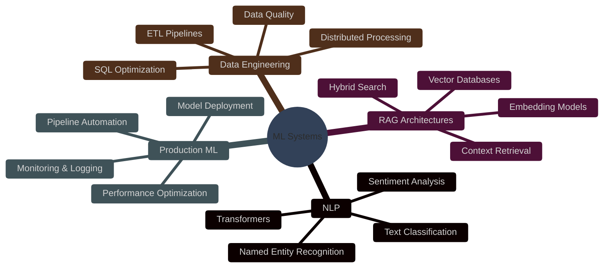

<div align="center">

<!-- Animated Wave Header -->


<!-- Typing Animation -->
<a href="https://git.io/typing-svg"></a>

</div>

---

##  SYSTEM_STATUS

```json
{
  "identity": {
    "name": "Vikash Gupta",
    "role": "Machine Learning Engineer",
    "location": "AI Research Terminal",
    "status": "Building intelligent systems"
  },
  "expertise": {
    "primary": ["ML Systems", "Natural Language Processing", "RAG Architectures"],
    "focus": "Production-ready AI solutions",
    "approach": "Research-driven, engineering-focused"
  },
  "mission": "Transforming complex ML research into scalable production systems",
  "current_objective": "Architecting next-generation AI applications"
}
```

---

##  TECH_STACK

```python
class MLEngineer:
    def __init__(self):
        self.languages = ["Python", "SQL"]
        self.ml_frameworks = ["TensorFlow", "Scikit-learn", "Pandas"]
        self.specialization = ["NLP", "RAG Systems", "ML Pipelines"]
        self.backend = ["Flask"]
        self.focus = "Production ML Systems"
    
    def build(self):
        return "Scalable AI solutions that ship"
```

<div align="center">


</div>

---

## ⚡ ACTIVE_PROJECTS

### 🔬 **Neural Document Retrieval System**
Production RAG pipeline processing 100K+ documents with sub-200ms latency. Hybrid search combining dense embeddings and BM25 ranking for enterprise knowledge base.

**Stack:** `TensorFlow` • `FAISS` • `Flask` • `PostgreSQL`

---

### 🧠 **Sentiment Analysis Pipeline**
Real-time sentiment classifier deployed on multi-million record datasets. Fine-tuned transformer models achieving 94% accuracy on domain-specific text.

**Stack:** `Hugging Face Transformers` • `Scikit-learn` • `Pandas`

---

### 📊 **ML Model Monitoring Dashboard**
Automated drift detection and performance tracking system. Real-time alerts for model degradation with automated retraining triggers.

**Stack:** `Python` • `Flask` • `SQL` • `TensorFlow`

---

### 🚀 **NLP Feature Extraction Engine**
Custom text processing pipeline extracting 50+ semantic features. Handles 10M+ documents with distributed processing architecture.

**Stack:** `spaCy` • `Scikit-learn` • `Pandas` • `Ray`

---

## 📡 SYSTEM_METRICS

<div align="center">


</div>

<div align="center">


</div>

---

## 🐍 CONTRIBUTION_GRAPH

<div align="center">


</div>

---

## 🎯 CORE_COMPETENCIES

<div align="center">



</div>

---

## 📬 CONNECT_PROTOCOL

<div align="center">

[](https://linkedin.com/in/YOUR_LINKEDIN)
[](https://github.com/YOUR_GITHUB_USERNAME)
[](mailto:your.email@example.com)
[](https://yourportfolio.com)

</div>

---

## 💡 PHILOSOPHY

```python
def engineering_principles():
    return {
        "research": "Deep dive into SOTA techniques",
        "implementation": "Clean, maintainable, production-grade code",
        "deployment": "Scalable systems that actually work",
        "iteration": "Continuous improvement through metrics",
        "impact": "ML solutions that solve real problems"
    }
```

---

<div align="center">

### ⚡ *"Building the future, one model at a time"* ⚡


</div>

---

<div align="center">

**[↑ Back to Top](#)**


</div>
